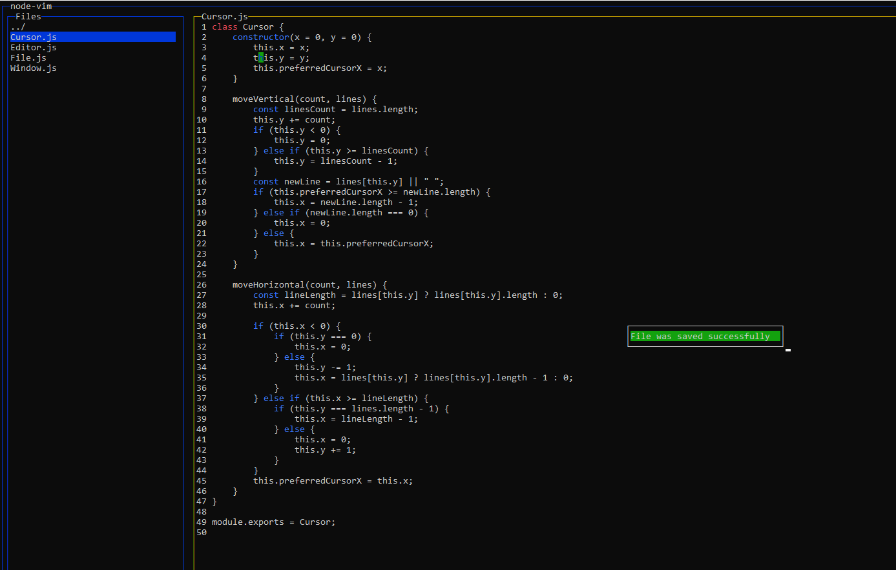

# Node-Vim (1.0.0)

Node-Vim is a terminal-based text editor built with Node.js and [blessed](https://www.npmjs.com/package/blessed), inspired by Vim. It features a plugin system, text editing capabilities, and a customizable interface.



## Features

- **Text Editing:** Basic text editing functionalities like inserting, deleting, and navigating text.
- **Plugin System:** Support for plugins.
- **Customizable Interface** Allows for extensive customization of the user interface through plugins
## Running and Installing

### Installing

1. **Clone the Repository:**

    ```bash
    git clone https://github.com/StillUsefull/node-vim.git
    ```

2. **Navigate to the Project Directory:**

    ```bash
    cd node-vim
    ```

3. **Install Dependencies:**

    ```bash
    npm install -g .
    ```

## Running

1. **Start the Editor:**

    ```bash
    node-vim run # Opens editor in current path.
    ```

2. **Install Plugins:**

    ```bash
    node-vim add-plugin <source> # Add a plugin from a Git repository or local path
    ```

    ```bash
    node-vim list-plugins # Get a list of current plugins
    ```

3. **Edit and Save:**

    - To edit text, select a file in the Files window.
    - To save changes, use `Ctrl+S` command.
    - To change files, exit the editor by pressing `Esc` and select a new file in the Files window.
    - To use text highlighter, install **'@ node-vim-highlighter'**. 
    - To use word-finder in the editor, install **'@ node-vim-search'**. 
    - To use file and folder creation/deletion, install **'@ node-vim-files'**. 

## Plugins

In Node-Vim, you can create plugins to extend the editor's functionality. Plugins allow you to add commands, assign hotkeys, and interact with different parts of the editor. To create a plugin, you need to follow a specific template and implement several key methods.

### Basic Plugin Structure

Plugins should extend the base Plugin class, which is defined in the ./plugin-interface/Plugin.interface file. Here’s what it looks like:

```
    class Plugin {
        constructor(name) {
            this.name = name;
        }

        register(pluginManager) {
            throw new Error('register method must be implemented');
        }
    }

    module.exports = Plugin;
```


### Key Concepts

```
    # example from @ node-vim-files

    register(pluginManager) {
        pluginManager.registerCommand('filemanager:createFileOrFolder', this.createFileOrFolder.bind(this));
        pluginManager.registerKeyBinding('ctrl+n', 'filemanager:createFileOrFolder');

        pluginManager.registerCommand('filemanager:deleteFileOrFolder', this.deleteFileOrFolder.bind(this));
        pluginManager.registerKeyBinding('ctrl+r', 'filemanager:deleteFileOrFolder');
    }
```


- **Command Registration:** Use pluginManager.registerCommand to register a command your plugin will handle. The command should be a unique string that identifies the action, such as filemanager:createFileOrFolder.

- **Key Bindings** Use pluginManager.registerKeyBinding to bind a specific key combination to a command, such as ctrl+n for creating a file or folder.

- **Command Prefixes:** Use the editor: prefix for commands related to text editing and filemanager: for commands related to file management.

**By following this structure, you can easily create and manage plugins for Node-Vim, adding new functionalities tailored to your needs.**


## Customizable Interface

 By creating plugins, you can modify the appearance and behavior of the editor, create custom windows, and implement visual elements like syntax highlighting.

** Example: Syntax Highlighting Plugin **

One example of interface customization is a **Syntax Highlighting Plugin**. This plugin identifies specific keywords in the code and applies custom styles to them, making it easier to read and understand the code. Below is an example of how this can be implemented:

```
	class SyntaxHighlightingPlugin {
    constructor() {
        this.name = 'SyntaxHighlightingPlugin';
        this.keywordStyles = {
            'class': { fg: '214', bold: true },   // Orange
            'function': { fg: '33', bold: true }, // Light blue
            'const': { fg: '33', bold: true },    // Light blue
            'let': { fg: '51', bold: true },      // Teal
            'var': { fg: '57', bold: true },      // Dark teal
            'return': { fg: '81', bold: true },   // Green
            'if': { fg: '81', bold: true },       // Green
            'else': { fg: '75', bold: true },     // Light green
            'for': { fg: '111', bold: true },     // Blue
            'while': { fg: '75', bold: true },    // Light green
            'require': { fg: '28', bold: true },  // Dark green
            'import': { fg: '28', bold: true },   // Dark green
            'from': { fg: '28', bold: true },     // Dark green
            'constructor': { fg: '81', bold: true }, // Green
        };
    }

    register(pluginManager) {
        pluginManager.registerDisplayUpdater(this.highlightKeywords.bind(this));
    }

    highlightKeywords(content, editor) {
        const lines = content.split('\n');
        
        return lines.map(line => {
            Object.keys(this.keywordStyles).forEach(keyword => {
                const regex = new RegExp(`\\b${keyword}\\b`, 'g');
                line = line.replace(regex, match => editor.window.colorize(match, this.keywordStyles[keyword]));
            });
            return line;
        }).join('\n');
    }
}

module.exports = SyntaxHighlightingPlugin;
```

### Key Concepts
- **Keyword Styling:** The plugin defines a set of keywords and the styles associated with them (e.g., color and boldness). This allows for specific words like class, function, or const to be highlighted in different colors.

- **Display Updater Registration:** The registerDisplayUpdater method allows the plugin to modify the content displayed in the editor. In this case, the highlightKeywords method is used to apply the styles to the relevant keywords.

- **Custom Windows:** In addition to styling, Node-Vim plugins can create custom windows for user interactions, such as prompts for file or folder names. This makes it possible to build complex user interfaces within the terminal-based editor.

By leveraging the customizable interface through plugins, you can tailor Node-Vim to your specific needs, enhancing both the functionality and the visual experience of the editor.


## Contribute

If you`d like to contribute to Node-vim development, you can make a pull request to [repo](https://github.com/StillUsefull/node-vim) or contact me about becoming a collaborator.

## Acknowledgements

- Inspired by Vim for its powerful text editing features.
- Uses Node.js and [blessed](https://www.npmjs.com/package/blessed) for building the terminal-based app
